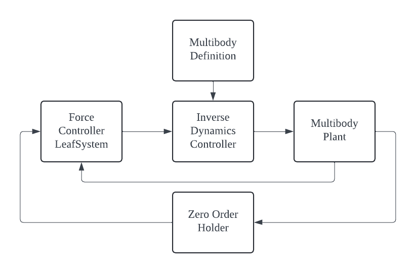

# Kinova Arm Control using PyDrake

Here comes a brief description about this project

## Table of Contents
- [Installation and setup](#installation)
- [Usage](#usage)
- [Features](#features)


## Installation
1. Create a virtual environment 
```bash
python -m venv env
```

2. Source the virtual environment
```bash
source env/bin/activate
```

3. Install the requirements
```bash
pip install -r requirements.txt
```
4. Clone the repository
```bash
git clone https://github.com/varun3105/pydrake-arm-control.git
```


## Usage
```bash
cd ~/path/to/your/folder
python3 multiarm_control.py
```
Access the simulation on localhost using the port number declared in the terminal after running the above commands

## Features

### Control Flow


